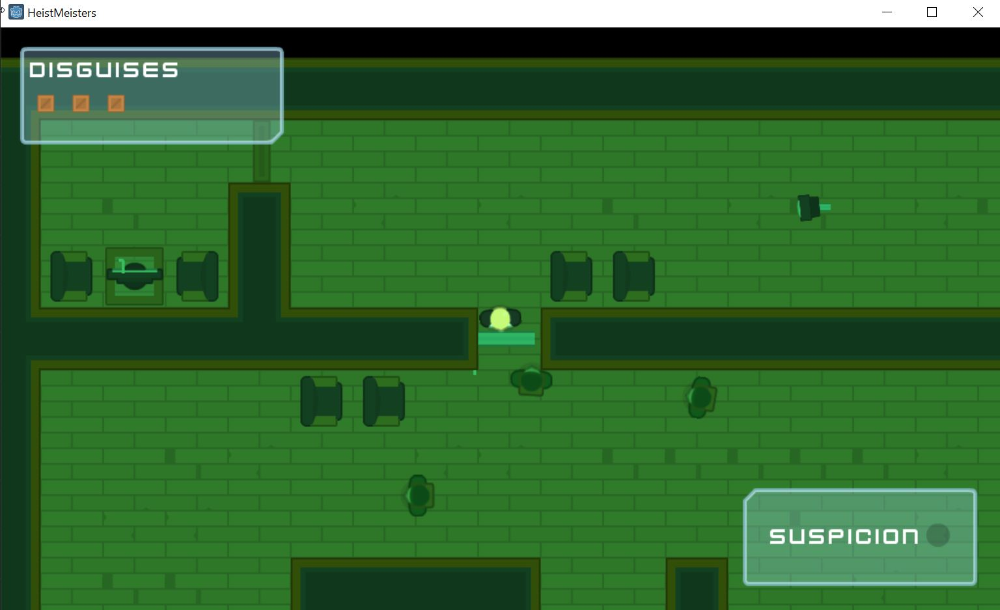

# Godot Stealth Game

This repo contains the build for a 2D game from learnings obtained on Udemy Course.

Credit to https://github.com/jnes92/udemy-games-godot

Game contains:
* 2D stealth game
* Objective to collect item and proceed to exit
* Main menu, exit menu, try again menu
* Tutorial level to show controls
* Suspection meter that increase when on line of sight
* NPCs walking around the map with torch
* Cameras with line of sight to catch

## Dependencies

This game was built with Godot v3.2.1.stable.official

